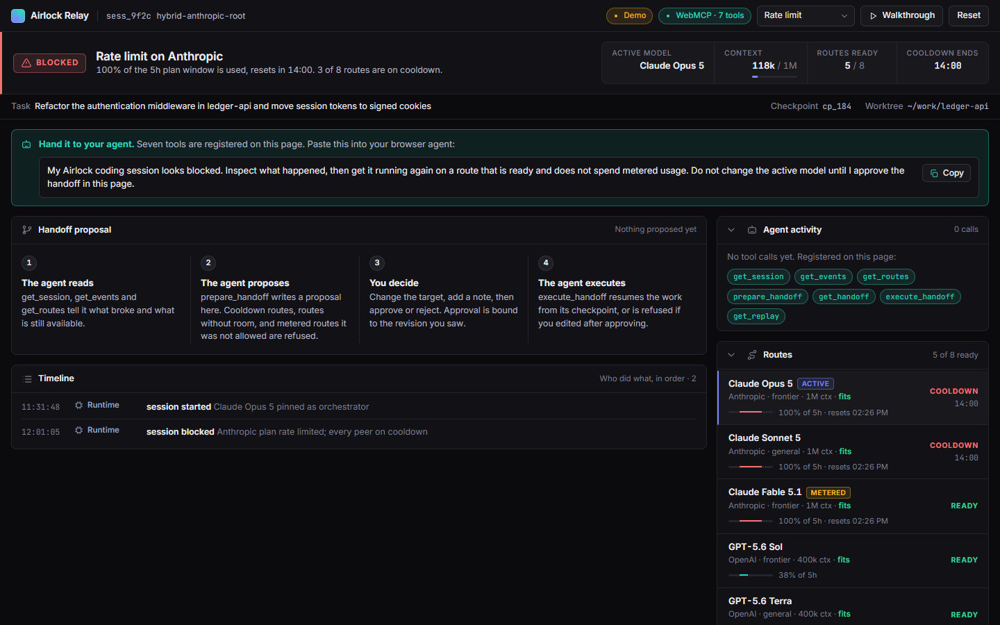
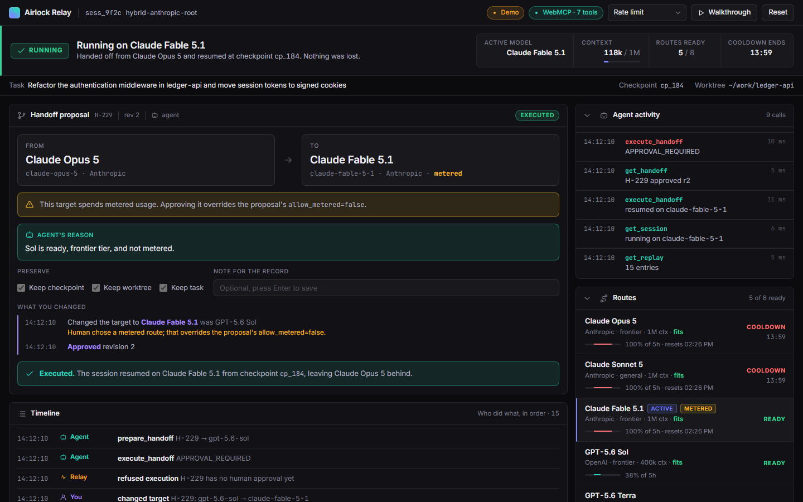
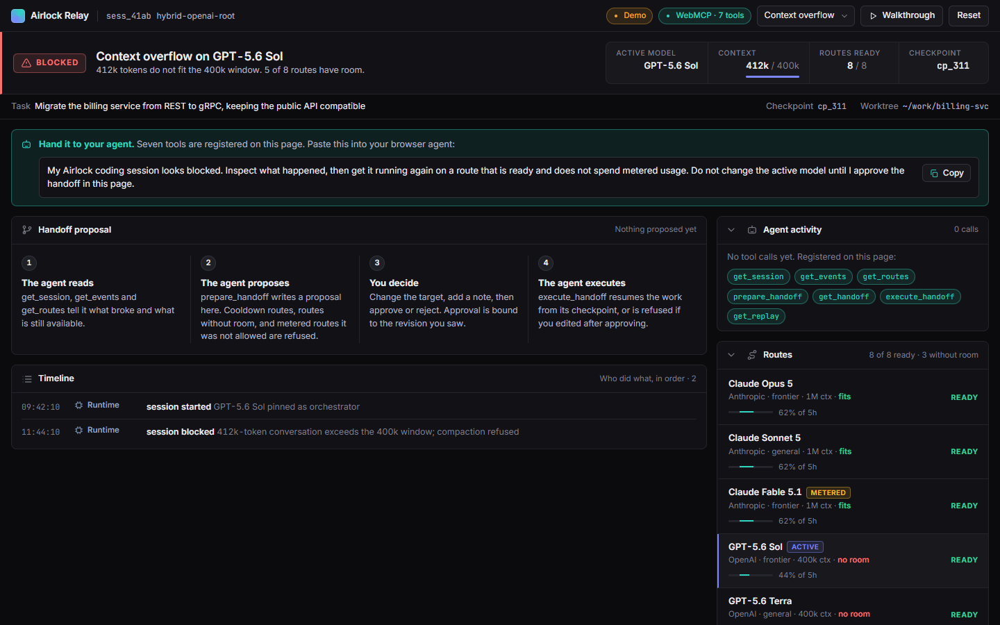
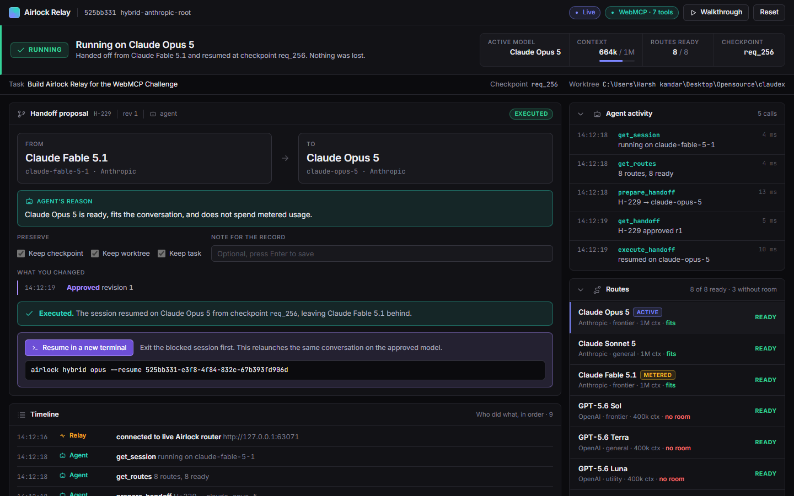
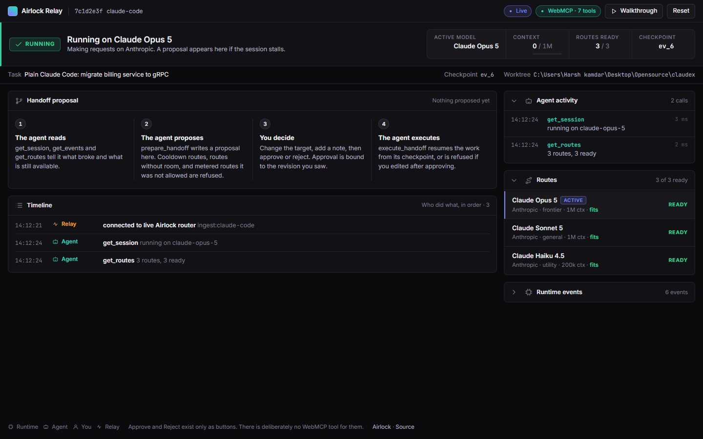

# Airlock Relay

**A WebMCP control room where a human and a browser agent supervise a live coding-agent session together, and hand it between model providers without losing the work.**

[](https://github.com/Harshkamdar67/airlock-relay/actions/workflows/deploy.yml) [](LICENSE)

Live demo: **https://harshkamdar67.github.io/airlock-relay/**
Built for [The WebMCP Challenge](https://webmcp.devpost.com/) on top of [Airlock](https://github.com/Harshkamdar67/Airlock). What is new for the challenge is listed in [WEBMCP_CHALLENGE.md](WEBMCP_CHALLENGE.md).





## The problem

Coding agents like Claude Code run for hours on one model. When that model's plan hits a rate limit at 2 AM, the session stops and a person has to work out what happened, which other model is available, whether it costs extra, and how to resume without losing the checkpoint. Airlock already routes one Claude Code session across Anthropic, OpenAI, Grok, and OpenRouter models and records every rate limit, cooldown, and failover on a local router. Until now the only way to supervise that runtime was a terminal.

Airlock Relay turns the runtime into a web page that two parties operate at once:

- **The human** sees the session, the routes, and a handoff proposal, and can edit, approve, or reject it with ordinary controls.
- **A browser agent** (ChatGPT's browser, or Chrome with WebMCP) reads the same state through seven typed WebMCP tools, proposes a handoff, waits for the human, notices what the human changed, and executes only with a token the approval issued.

Nothing is inferred from the DOM. The page declares what a session, a route, and a handoff mean, and both parties act on the same object.

## What the agent can do

| Tool | Kind | What it does |
| --- | --- | --- |
| `get_session` | read | Task, active model and provider, blocked or running, why (`rate_limit` or `context_overflow`), context size against the active window, checkpoint. |
| `get_events` | read | The router's event log: requests, 429s, cooldowns, failover attempts, handoff activity. Marked `untrustedContentHint` because summaries relay upstream text. |
| `get_routes` | read | Every route with provider, tier, context window, whether it fits the session's context, plan headroom for its provider, ready or cooldown, and whether it spends metered usage. |
| `prepare_handoff` | write | Creates a proposal. Refuses cooldown routes, routes whose window is smaller than the session, and metered routes unless `allow_metered` is true. Each refusal lists alternatives. Never switches anything. |
| `get_handoff` | read | Status, revision, target, every change the human made, and the approval token once approved. |
| `execute_handoff` | write | Resumes the session on the approved route. Fails with `APPROVAL_REQUIRED` before approval and `STALE_APPROVAL` if the human edited after approving. Idempotent. |
| `get_replay` | read | The attributed timeline: runtime, agent, and human actions in order. |

There is deliberately **no approve tool**. Approve and Reject exist only as buttons. Approval issues a token bound to the proposal's revision, and any edit revokes it, so the agent has to come back and read what the human decided.

## Try it in two minutes

1. Open the live URL in the **ChatGPT desktop app's browser**, or in **Chrome 149+** with `chrome://flags/#enable-webmcp-testing` enabled and Chrome relaunched (verified on Chrome 152.0.7977.65 on Windows, both through the flag and through `--enable-features=WebMCPTesting`). The pill in the top bar should say "WebMCP · 7 tools".
2. Ask the agent:
   > My Airlock coding session looks blocked. Inspect what happened, then get it running again on a route that is ready and does not spend metered usage. Do not change the active model until I approve the handoff in this page.
3. Watch the Agent activity rail. The agent should read the session, events, and routes, then propose a handoff to a ready non-metered route such as GPT-5.6 Sol. If it tries to execute early, the page refuses.
4. In the proposal card, **change the target** to Claude Fable 5.1 (a metered route) and click **Approve**.
5. Tell the agent "continue". It should re-read the proposal, notice your change and that you accepted metered usage, and execute. The session flips to running on Fable from checkpoint `cp_184`, and the Replay shows who did what.

No WebMCP in your browser? Click **Run scripted walkthrough**. It calls the same tool entry point an agent would, pauses at the approval, and finishes after you approve.

### Second scenario: context overflow

Switch the scenario selector to **Context overflow**. A GPT-5.6 Sol session has outgrown its 400k window (412k tokens) and Airlock's own overflow failover to Terra failed for the same reason. No provider is rate limited, so the constraint the agent has to reason about is the context window: `get_routes` reports `fits_session_context` per route, and `prepare_handoff` refuses a route without room with `CONTEXT_EXCEEDS_ROUTE_WINDOW` and a list of routes that fit. The human's target selector only offers routes with room too. A good agent proposes Grok 4.6 (2M window, not metered) or Claude Opus 5 (1M).



Every route also carries the provider's plan headroom (used percent of the 5-hour window and when it resets), the same numbers Airlock reads from Claude Code's status line, so the agent can avoid proposing a route that is about to hit its own limit.

## Connect your own agent in two minutes

The page is the same in every mode. Only where the facts come from changes. You need Python 3.10+ and a clone of this repo; the built page ships in `bridge/site`, so Node is optional.

**Airlock session** (inside the session, so the router URL is in the environment):

```bash
python bridge/relay.py --task "what the session is doing" --open
```

**Plain Claude Code** (no Airlock):

```bash
python bridge/relay.py --source claude-code --workdir ~/work/app --model claude-sonnet-5[1m] --open
```

Then copy `bridge/hooks.example.json` into `~/work/app/.claude/settings.local.json`, replacing `RELAY_HOOK` with the absolute path to `bridge/claude_code_hook.py`, and start Claude Code in that directory. Every hook posts to the bridge and exits within a second; Claude Code never waits on it.

**Any other agent:** start with `--source generic` and POST `state` and `event` documents to `http://127.0.0.1:4783/relay/api/ingest` as described in [docs/ingest-contract.md](docs/ingest-contract.md).

Then open `http://127.0.0.1:4783/` in the ChatGPT desktop browser or in Chrome with WebMCP enabled, and hand the page to the agent. Add `--notify https://ntfy.sh/your-topic` (or a Slack or Discord webhook) to get pushed when the session blocks; a desktop notification shows by default.

Windows note: Airlock's launcher is a Bash script, so the bridge runs Airlock commands through Git Bash, which Airlock already requires.

### What was verified for real, not only in unit tests

| Check | How |
| --- | --- |
| Tools discovered and executed through the browser's own WebMCP API | `scripts/webmcp-smoke.mjs` on the deployed URL, Chrome 152 with `--enable-features=WebMCPTesting` |
| Live Airlock mode on a real router | Bridge started inside a real Airlock session; page showed the real profile, model, events, and this session's Claude Code id |
| Real `airlock handoff set` through the bridge | Executed handoff ran `airlock handoff set fable opus sol grok` on a real install, verified with `airlock handoff`, then restored |
| Approval gate on the bridge | Forged `POST /relay/api/handoff` and `POST /relay/api/resume` refused; genuine approve then execute accepted |
| Claude Code hooks with the real `claude` CLI | `scripts/hook-e2e.sh --with-real-call`: SessionStart, Stop, and SessionEnd reached the bridge with a real session id |
| Block detection for Claude Code | Verified with the documented `StopFailure` hook payload through `bridge/claude_code_hook.py`; a live provider failure was not reproducible on demand in print mode |
| Resume, for real | `scripts/resume-e2e.sh`: against a scratch Claude Code session, the page's Resume button opened a terminal running `airlock hybrid sonnet --resume <id>`, and a `claude.exe` process launched by Airlock's launcher with that id was observed, then stopped |

## Works with

| Runtime | How Relay gets its facts | Block signal | Resume |
| --- | --- | --- | --- |
| **Airlock** | The router's loopback `GET /diagnostics` and `GET /v1/models`, polled by the bridge. | Router cooldown lists and chain-exhausted events. | `airlock hybrid <route> --resume <session-id>` |
| **Plain Claude Code** | Claude Code hooks POST to the bridge through `bridge/claude_code_hook.py` (settings snippet in `bridge/hooks.example.json`). | The `StopFailure` hook: rate limit, overloaded, billing, server error, model not found. | `claude --resume <session-id> --model <alias>` |
| **Any agent** | Your runtime POSTs small JSON `state` and `event` documents to `relay/api/ingest`. Contract in [docs/ingest-contract.md](docs/ingest-contract.md). | An event with `failure` set. | Whatever your runtime supports; the executed handoff is on the page. |

In every case the page, the seven WebMCP tools, the approval model, and the replay are identical. Only the adapter changes.

**Notifications.** When the session becomes blocked, the bridge shows a desktop notification (Windows, macOS, Linux) and, with `--notify URL`, POSTs to a webhook: ntfy topics, Slack and Discord incoming webhooks, or any JSON receiver, each in the shape that destination expects.

## Demo mode and live mode

The hosted page runs in **demo mode**. Its data comes from [fixtures/airlock-diagnostics-2026-09-03.json](fixtures/airlock-diagnostics-2026-09-03.json), an export of the real `GET /diagnostics` report from an Airlock router on 2026-09-03. Events tagged `airlock` were copied verbatim; events tagged `scenario` were added, in the router's exact event shapes, to put the session into the blocked state the demo starts from. The runtime that "resumes" is simulated, and the session card's task, id, checkpoint, and worktree are invented for the demo; only the router data underneath is real. The page labels the origin of every event.

**Live mode** runs against a real Airlock session on your machine. This is the version built to be used, not only demoed:

```bash
npm install && npm run build
# from inside an Airlock session, in the project you are working on:
python bridge/relay.py --task "what the session is doing" --notify https://ntfy.sh/your-topic --open
# or from anywhere:
python bridge/relay.py --router-url http://127.0.0.1:PORT --workdir ~/work/app
```

What the bridge does, in order:

1. **Discovers the session.** The router URL comes from `AIRLOCK_SESSION_ROUTER_URL` (or `--source claude-code` / `--source generic` for the other adapters); the Claude Code session id comes from the transcript directory Claude Code keeps for the working directory.
2. **Feeds the page real facts.** A same-origin `relay/api/state` endpoint is fed by the router's existing loopback `GET /diagnostics` and `GET /v1/models`: profile, active model, cooldowns, every request and failover event, context size from the last request. The Airlock router is not modified and stays bound to 127.0.0.1.
3. **Tells you when it blocks.** The moment the runtime reports the active model or its provider unusable, the bridge shows a desktop notification and, with `--notify`, POSTs to your webhook with the Relay link. That is the 2 AM use case.
4. **Records your approval itself.** Your Approve click is also sent to the bridge, which returns a one-shot nonce bound to the proposal, revision, and target. A page script cannot forge it.
5. **Persists the decision with Airlock's own command.** When the agent executes with a matching nonce, the bridge runs `airlock handoff set <from> <to>`, so the approved order lives in Airlock's declared failover chain. Otherwise it refuses with a reason, and the page shows exactly what happened.
6. **Resumes the conversation on the approved model.** After execution the bridge prepares `airlock hybrid <route> --resume <session-id>`. A human-only **Resume in a new terminal** button opens a terminal in the working directory running that command, which relaunches the same Claude Code conversation with the approved orchestrator. Airlock's launcher forwards Claude flags, so this is a supported path, and the button is gated by a second one-shot nonce. Exit the blocked session first; it is stuck anyway.

Nothing here restarts a process behind your back. The agent inspects and proposes, you approve, Airlock's own commands do the work, and the page shows the receipts.





## How WebMCP is used

- Tools are registered once on load with `document.modelContext.registerTool`, each with a JSON Schema, a use-case description, and annotations. Reads carry `readOnlyHint: true`; the event log carries `untrustedContentHint: true`.
- Tool results are bounded (40 events, 60 replay entries) and every error is structured (`code`, `message`, `hint`) so the agent can self-correct instead of guessing.
- The same handlers serve WebMCP, the scripted walkthrough, and the tests, so the agent path is never a special case.
- Human actions and agent actions mutate one store and are both attributed in the replay. The approval token is the concrete mechanism that makes "the human decides" enforceable inside the page, and in live mode the bridge keeps its own approval record so a page script cannot reach the real command on its own.

## Security posture

- Tool results never include raw upstream bodies. Event summaries are short, generated strings, and the event log is marked `untrustedContentHint` so agents treat relayed provider text as data.
- No tool can approve. The approval token exists only after a click in the page, is bound to the proposal revision, and is revoked by any edit. Execution is idempotent.
- The store is not reachable from the console unless the page is opened with `?debug=1`.
- The live bridge binds to 127.0.0.1, talks only to the router's loopback endpoints, records approvals itself, and refuses to run the real Airlock command without its own one-shot nonce. The Airlock router is not modified.
- Nothing is stored server-side. The hosted page is static.

## Design

The console is dark-first with layered elevation instead of shadows, one accent, four actor tints, 36px rows, and tabular numerals. The critical status sits top-left with the four numbers that decide the next action beside it; everything else is progressive disclosure. That follows what the strongest operations consoles do today, see [925studios on SaaS dashboard patterns](https://www.925studios.co/blog/saas-dashboard-design-examples-2026), [AYDesign on dark-mode dashboards](https://www.aydesign.ai/blog/dark-mode-dashboard-design-patterns-2026), and the [UXPin dashboard principles guide](https://www.uxpin.com/studio/blog/dashboard-design-principles/).

## Development

```bash
npm install
npm run dev          # Vite dev server
npm test             # 22 Vitest tests on the state machine, both scenarios, and the tools
npm run typecheck
python -m unittest discover -s bridge -p "test_*.py"   # bridge tests
npm run build && npx vite preview --port 4173
node scripts/webmcp-smoke.mjs http://127.0.0.1:4173/  # drives the tools through Chrome's document.modelContext
```

The smoke test launches Chrome with `--enable-features=WebMCPTesting`, lists the registered tools, and runs the whole flow (metered refusal, early execution refused, human edit and approve in the page, execution, resumed session) through `executeTool`, not through the page's own functions.

## Layout

```
src/runtime/   types, store, Airlock diagnostics adapter, demo builder, live client
src/webmcp/    tool specs and handlers, WebMCP registration, scripted walkthrough
src/ui/        the control room
bridge/        local bridge for live sessions, with tests
fixtures/      the real diagnostics export the demo is built from
scripts/       Chrome smoke test
tests/         Vitest suite
```

## License

MIT. See [LICENSE](LICENSE).
